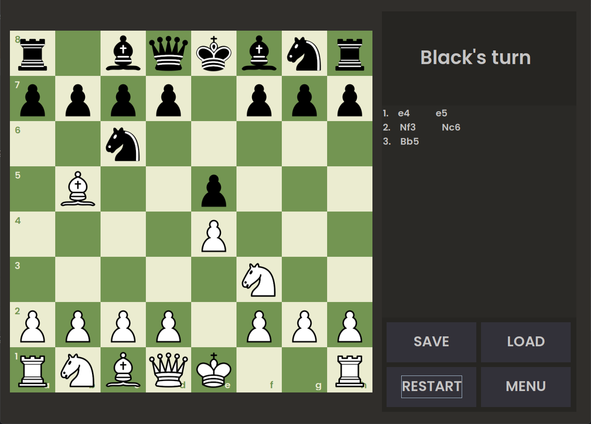

# Chess Game

## Overview
This project is a fully functional **Chess game** built with **Java** and **Java Swing** for the graphical user interface (GUI). The game allows two players to play a classic chess match on the same machine with all standard rules implemented.

## Features
- **Interactive GUI**:
  - Choosing tiles functionality for moving pieces.
  - Visual indicators for valid moves.
- **Standard Chess Rules**:
  - Legal piece movement enforced.
  - Pawn promotion, castling, and en passant implemented.
  - Check and checkmate detection.
- **Highlights**:
  - Displays current player’s turn.
  - Shows captured pieces for each side.
- **Error Handling**:
  - Prevents illegal moves with on-screen feedback.
- **Saving**
  - Previous game could be saved for later continuation

## Gameplay

## Technologies Used
- **Programming Language**: Java
- **GUI Framework**: Java Swing
- **Development Environment**: IntelliJ IDEA

## How to play
- Choose appropriate option from main menu.
- Launch the application.
- Player 1 (white) starts the game.
- Choose and put a piece to a valid position; invalid moves will be blocked.
- The game continues until one player is checkmated, resigns, or the game ends in a stalemate.

## Project Structure
- `Main.java` - Entry point of the game
- `src/main/` - General classes
- `src/piece/` - All game pieces
- `res`- Game assests like sprites and map parts
- `README.md` - Project documentation
- `LICENSE` - Project license

## Licence
This project is licensed under the MIT License

## Acknowledgments
Inspired by the original chess game
